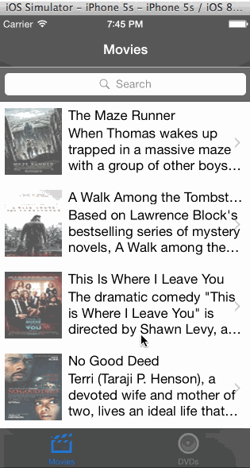

# RottenTomatoes Box Office Demo

This is an iOS Swift demo application for displaying the latest box office movies using the [RottenTomatoes API](http://www.rottentomatoes.com/).
Time spent: 8 hours spent in total

Completed user stories:

 * [x] Required: User can view a list of movies from Rotten Tomatoes. Poster images must be loading asynchronously.
 * [x] Required: User can view movie details by tapping on a cell
 * [x] Required: User sees loading state while waiting for movies API
 * [x] Required: User sees error message when there's a networking error
 * [x] Required: User can pull to refresh the movie list
 * [x] Optional: All images fade in
 * [x] Optional: All images should be cached in memory and disk
 * [x] Optional: Customize the navigation bar
 * [x] Optional: Add a tab bar for Box Office and DVD

GIF created with [LiceCap](http://www.cockos.com/licecap/).
